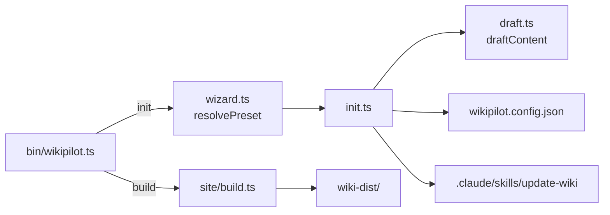
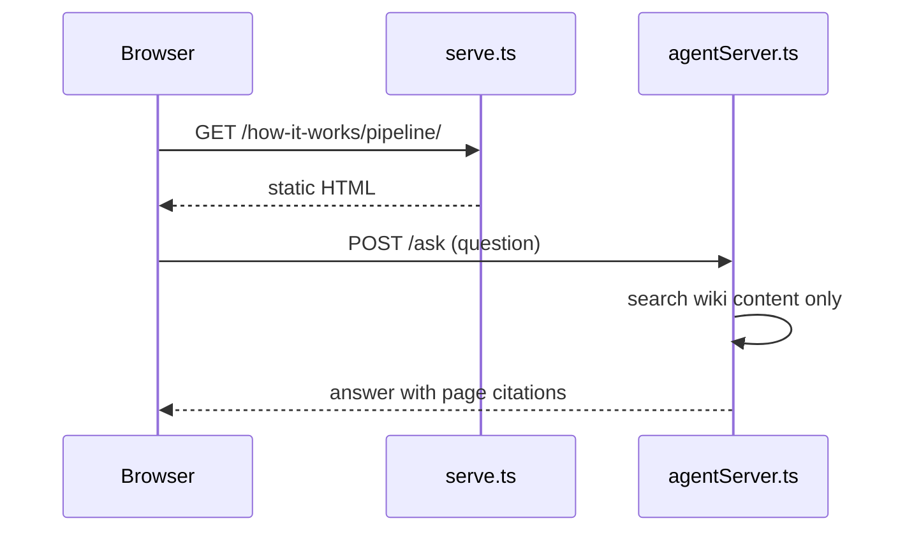

# wiki-init — from scaffold to real documentation

`wikipilot init` drafts a wiki mechanically: it reads `package.json` and the
README and produces an overview, install steps, one page per dependency, and a
file map. That draft is a floor, not a finished wiki. This skill is the second
pass — a Claude agent (Sonnet or better) investigates the repository properly
and rewrites every page from what the code actually does.

**Core principle: every sentence must be traceable to code you have read.**
The difference between a professional wiki and an embarrassing one is not
formatting — it is whether the prose survives being checked against the repo.

This skill covers the *initial* build. Ongoing maintenance (sync, audit,
authoring single pages later) belongs to the `update-wiki` skill that `init`
scaffolds into `.claude/skills/update-wiki/`.

---

## What you are working with

The wiki lives at `wiki/content/<locale>/<section>/<slug>.md`. The sections
are listed in `wiki/wikipilot.config.json` under `sections` (authoritative —
edit it to add or drop sections), with `preset` recording which preset chose
them. The same file carries `siteName`, `version`, `locales`, and
`sourcesOfTruth`; leave those alone during init unless the user asks.

| Preset | Sections |
|---|---|
| `all` (the default) | `start-here`, `getting-started`, `guides`, `how-it-works`, `technologies`, `cookbook`, `faq`, `troubleshooting`, `reference` |
| `technical` | `start-here`, `how-it-works`, `technologies`, `reference`, `cookbook` |
| `user-guide` | `start-here`, `getting-started`, `guides`, `faq`, `troubleshooting` |

Every page carries a freshness contract in its frontmatter:

```yaml
---
title: The Publish Pipeline
description: How a draft becomes a published document.
section: how-it-works
order: 2                 # optional; sidebar position within the section
sources:                 # repo globs this page documents — the drift contract
  - src/publish/**
  - src/queue/worker.ts
last_synced: "d70bf9b"   # `git rev-parse --short HEAD` when prose was verified
version: "1.4.0"         # the project's package.json version at that moment
locale: en
---
```

The scaffolded pages are the live schema — mirror their fields. One field you
won't see in them: `stale`. It's absent until a later sync can't confidently
patch a drifted page and sets `stale: true`; you never set it during init.

`sources` is what makes the wiki maintainable: later sync runs diff
`last_synced..HEAD` against those globs to find drift. A page with `**/*` as
its sources can never report drift. Set the narrowest globs that truly cover
the page — this is part of authoring, not an afterthought. When a page
documents an *absence* ("no tests yet"), point `sources` at the files whose
change would falsify the claim (`package.json`, the directory that would hold
the tests) so the claim still gets re-checked.

---

## Phase 1 — Investigate before writing anything

Do not open a wiki page until the investigation is done. Writing
section-by-section while discovering the repo produces the disjointed,
generic prose this skill exists to prevent. Keep notes in a scratch file, not
in wiki pages.

Work through these in order; each builds on the last:

1. **Entry points.** `package.json` (`bin`, `main`, `exports`, `scripts`),
   `Dockerfile`, CI workflows, `Makefile`. These tell you what the project
   *is* — a CLI, a service, a library, a site — before any README claim does.
2. **The primary flow, end to end.** Pick the thing a user most obviously
   does (the main CLI command, the main endpoint, the main export) and read
   the code path from entry to result. Note every module it passes through —
   this trace becomes the backbone of `how-it-works` and its diagrams.
3. **The tests.** Tests state intended behaviour more honestly than comments
   or the README. A test named `"a non-interactive stdin never blocks"` is a
   documented guarantee; harvest these.
4. **Configuration surface.** Env vars (`process.env`, `.env.example`),
   config files, CLI flags, defaults. This becomes `reference` material and
   tells you what "getting started" should actually say.
5. **Data model.** Schemas, migrations, type definitions, wire formats.
   If entities relate to each other, this is where an `erDiagram` comes from.
6. **Dependencies, with receipts.** For each direct dependency, find the
   files that import it and what it is used *for in this repo*. "Commander —
   parses the CLI" is a real finding; a paraphrase of the dependency's own
   README is not.
7. **Boundaries and non-goals.** What the project deliberately does not do
   (check README, comments, closed-over decisions in code). Documenting a
   boundary prevents the wiki from over-promising.
8. **Recent history.** Skim `git log --oneline -30` for the "why" behind
   things that look odd. Never state a "why" you could not verify — mark it
   as an open question instead.

**Exit criteria for this phase:** you can sketch the architecture from memory,
name the primary flow's modules in order, and say what each direct dependency
is for. If you can't, keep reading.

**If the investigation comes up nearly empty** — a scaffold with no source, a
repo that is mostly config — that is itself the finding. Write the few pages
the evidence supports, say plainly what does not exist yet, skip everything
else, and tell the user the wiki is thin because the repo is. Do not manufacture
content to make an empty repo look documented.

## Phase 2 — Plan the page map

With the investigation done, decide what pages this repo actually needs.
The scaffolded stubs are suggestions: rewrite them in place when the topic is
right (keeping the slug keeps the URL), and delete, merge, or add pages
freely. A section's `index.md` is its landing page, served at `/<section>/` —
it gets rewritten or deleted like any other draft. For a mid-sized repo,
10–20 substantial pages is a reasonable shape — but the evidence sets the
number, never the target. When the two conflict, write fewer pages.

| Section | Draw from the investigation | Typical pages |
|---|---|---|
| `start-here` | entry points, boundaries | one overview: what it is, who it's for, where to go next |
| `getting-started` | scripts, config surface | installation; first result in under five minutes |
| `guides` | primary + secondary flows | one page per user goal, named after the goal |
| `how-it-works` | the end-to-end trace | architecture; the primary flow; any lifecycle with named states |
| `technologies` | dependency receipts | one page per dependency that matters, citing the files that use it |
| `cookbook` | scripts, tests | short task → command → result recipes |
| `faq` | boundaries, gotchas found while reading | real questions, answered in the first two sentences |
| `troubleshooting` | error paths, guards in the code | symptom → cause → fix |
| `reference` | config surface, data model | flags, env vars, config keys, schemas — exhaustive |

Skip a section rather than pad it. Three honest FAQ entries beat ten invented
ones, and an empty section is a visible TODO while a padded one is a trap.

## Phase 3 — Author the pages

Before writing, open `.claude/skills/update-wiki/SKILL.md` (scaffolded by
`init`) and read its per-section briefs — they define the shape each section's
pages should land in, and they are not repeated here. Then write each page
from your investigation notes. Lead with what the thing does and why it
exists, then how it works. Concrete names, real paths, real commands — every
read-only command actually run before it is written down (don't execute
installs, migrations, or deploys just to quote them; say they were not run).

### Code snippets: pulled, never composed

Every snippet is **copied from a real file** and captioned with its path:

````
```ts title="src/lib/wizard.ts"
export async function resolvePreset(options: PresetOptions, io: PromptIO): Promise<WikiPreset> {
  if (options.preset) {
    // …
  }
  if (options.yes || !io.interactive) return DEFAULT_PRESET;
```
````

The `title="…"` renders as a caption and tells the next sync run which file to
re-read. Trim to the lines that matter, mark elisions with `// …`, and never
edit the lines you keep. A snippet you had to "fix" means you misread the code
— go back.

### Diagrams: Mermaid, derived from the trace

Mermaid fences render natively in the built site. A diagram earns its place
when structure is hard to hold in prose; it is never decoration. Every node
and edge must come from code you read in Phase 1 — an invented arrow is a lie
with a diagram's authority.

Pick the type by what you are showing:

| You are showing | Use |
|---|---|
| How components connect, request paths, decision logic | `flowchart` |
| Multi-actor flows over time (handshakes, queue → worker → callback) | `sequenceDiagram` |
| Data model relationships, from real schemas | `erDiagram` |
| A lifecycle with defined states (job status, order status) | `stateDiagram-v2` |
| Type relationships, when they are the point | `classDiagram` |

An architecture flowchart for `how-it-works`, drawn from an entry-point trace:

````

````

A sequence diagram for a multi-actor flow:

````

````

Rules that keep diagrams trustworthy:

- Name nodes after the real modules, services, and files in this repo.
- Label edges with what actually crosses them (`POST /publish`, `job_id`) —
  not `calls` or `uses`.
- Keep it under ~12 nodes; split before it becomes a mural.
- One sentence before each diagram saying what to look at in it.

### Renderer constraints

The site is built with markdown-it, **raw HTML disabled**, no
syntax-highlighting pass:

- `<div>`, ``, `<br>` will not render in page bodies — use markdown, or
  Mermaid for visuals. (Inside a mermaid fence this rule doesn't apply: the
  fence is handed to Mermaid untouched, so `<br/>` in a node label is fine.)
  Code-fence language tags are labels, not colouring.
- Tables, task lists, and fenced code all work.
- Pages are served at `/<section>/<slug>/` and each section's `index.md` at
  `/<section>/`. Cross-section links go up two levels
  (`[Refunds](../../guides/refunds/)`), same-section links one
  (`[Refunds](../refunds/)`).

### Stamping

Before leaving a page: `last_synced` = `git rev-parse --short HEAD`,
`version` = the project's current `package.json` version, and a one-line
`description` — it is the search preview and sidebar blurb, so make it say
something ("How a draft becomes a published document", not "Documentation for
the publish module").

## Phase 4 — Verify before calling it done

1. `wikipilot build` (add the wiki path if it isn't `./wiki`) must succeed.
   Then `wikipilot serve` and actually look
   at a few pages — broken cross-links and unreadable diagrams only show up
   rendered.
2. Re-check every snippet against the file in its `title="…"`.
3. Re-check every diagram edge against the code it claims to describe.
4. Confirm every page's `sources` globs resolve to files that exist and
   genuinely cover the page.
5. Read the whole wiki top to bottom in one pass. Repetition, contradictions,
   and tonal drift between pages are only visible at this level.
6. Land it as a reviewable commit or PR — a human should eyeball an
   AI-written wiki before it merges. Do not push automatically.

---

## What "unprofessional" looks like — and the fix

These are the failure modes this skill exists to prevent. If you recognise
one in your output, the fix is always the same: go back to the code.

| Symptom | Why it happens | Fix |
|---|---|---|
| Dependency pages that paraphrase the package's own README | Wrote from prior knowledge, not from the repo | Cite the importing files; say what it does *here* |
| A diagram that mirrors the folder tree | Drew structure instead of behaviour | Diagram the Phase 1 trace, not `ls` |
| "This project provides a robust, flexible…" | Filling space instead of reporting findings | Delete the adjective; state the concrete fact that justified it |
| Scaffolded placeholder text still present | Wrote new pages instead of replacing the draft | Every drafted page gets rewritten or deleted |
| `sources: ["**/*"]` | Postponed the contract | Narrow globs per page, set while writing |
| Commands that were never run | Trusted the README | Run each one; paste real output where a guide shows output |
| Ten FAQ entries nobody asked | Padding a section to look complete | Keep the three real ones; skip the rest |
| A "why" stated with confidence but no evidence | Guessed intent | Mark it as an open question for a human |

## Ground rules

- Investigation first, prose second. No page is written before Phase 1 ends.
- Never invent facts to fill a gap — a short accurate page beats a long wrong
  one.
- Snippets are copied, captioned, and unedited. Diagrams are derived, not
  imagined.
- Small claims, verified, beat sweeping claims that merely sound complete.
- When done, hand maintenance over: point the user at the `update-wiki`
  skill ("update the wiki", "audit the wiki") for everything after today.
